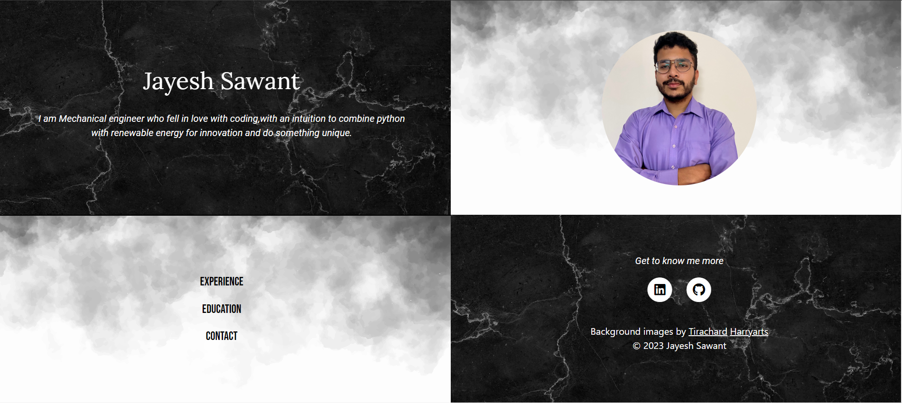
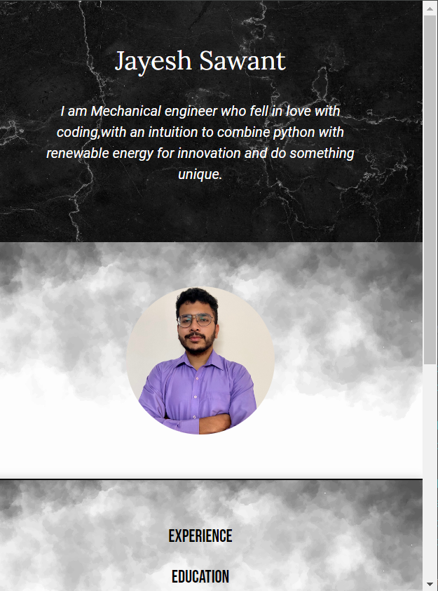
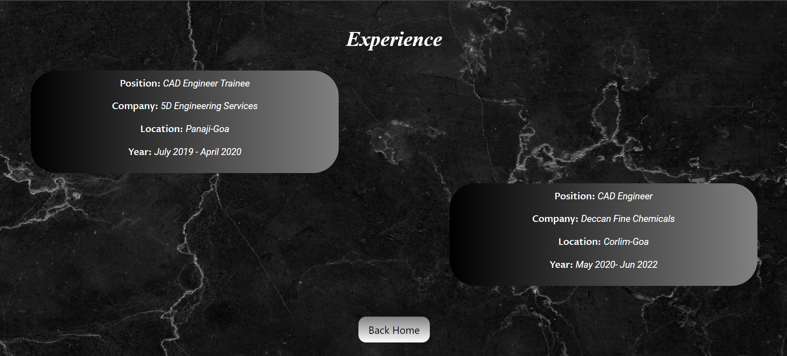
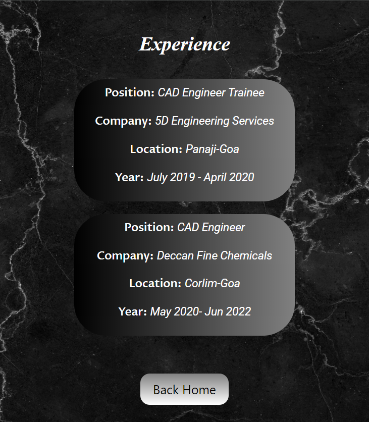
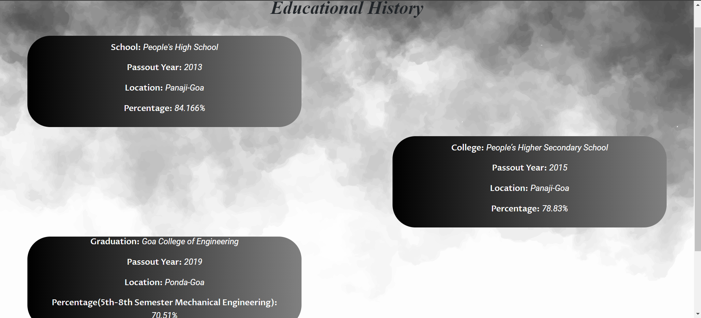
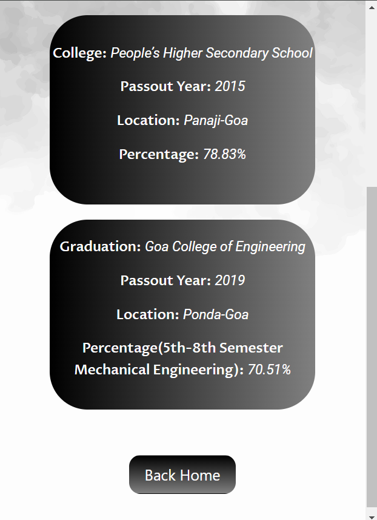
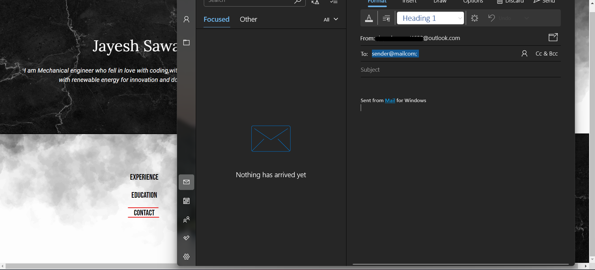

# Personal Site Project

## Overview

This project is a personal website developed using Python Flask, HTML, CSS, and Bootstrap. It serves as a portfolio to showcase your skills, experience, and projects.

## Features

- Responsive design with Bootstrap for a seamless experience on different devices.
- Sections for introduction, profile picture, experience, education, contact information and Links to external profiles such as LinkedIn and GitHub.

## Requirements

- Python 3.x
- Flask
- Bootstrap

## Working of Website:

### Home Page:

### Experience Page:

### Education Page:

### Contact:
